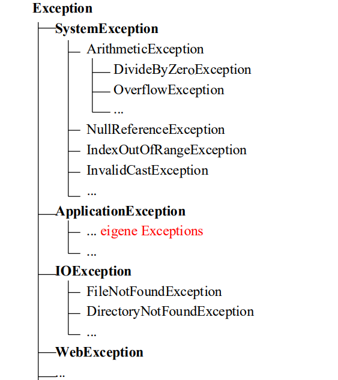

# Exceptions in C#

---

## Einleitung - Was ist falsch an Rückgabewerten?

Die meisten Programmierer haben wahrscheinlich bereits Code geschrieben, der dem folgenden sehr ähnlich ist:

```csharp
bool success = CallFunction();
if (!success) {
// Fehler verarbeiten
}
```

Diese Methode funktioniert, es muss jedoch jeder Rückgabewert auf Fehler geprüft werden. Wenn das obige Beispiel als

```csharp
CallFunction();
```

geschrieben wäre, würde jede Fehlerrückgabe verworfen werden. Dies ist eine potenzielle Quelle für Bugs in vielen Programmen.

In der .NET-Laufzeitumgebung stellen Ausnahmen die fundamentale Methode zur Behandlung von Fehlerbedingungen dar - sie können nicht ignoriert werden.

---

## Einleitung - try and catch

Zur Behandlung von Ausnahmen muss der Code ein wenig anders organisiert werden. Die Codeabschnitte, die zu Ausnahmen führen können, werden in einem `try-Block` platziert, der Code zur Behandlung von Ausnahmen im `try-Block` wird in einen `catchBlock` geschrieben. Beispiel:

---

## Beispiel

```csharp
using System;
class Test{
  static int Zero = 0;
  public static void Main()
  { // Hier auf Ausnahmen achten
    try
    {
      Console.WriteLine(“Test einer Division durch 0!");
      int j = 22 / Zero;
      Console.WriteLine(“Diese Ausgabe wird NIE ausgeführt!");
    } // Ausnahmen, die im try-Block auftreten, werden hierher übermittelt
    catch (img/image e)
    {
      Console.WriteLine("Exception " + e.Message);
    }
    Console.WriteLine("After catch");
  }
}
```

---

## Erläuterung zum Beispiel

Der `try-Block` umfasst einen Ausdruck, der zur Erzeugung einer Ausnahme führt. In diesem Fall wird die Ausnahme DivideByZeroException erzeugt. Wenn die Division stattfindet, stoppt die .NET-Laufzeitumgebung die Codeausführung und sucht nach
einem `try-Block`, der den Code enthält, in dem die Ausnahme auftrat. Sobald ein `tryBlock` ermittelt wurde, wird nach dem entsprechenden `catch-Block` gesucht.

Ist ein solcher `catch-Block` vorhanden, wird der geeignetste ausgewählt (zum
Auswahlverfahren gleich mehr) und der im catch-Block enthaltene Code wird
ausgeführt. Der Code im `catch-Block` kann das Ereignis verarbeiten oder das Ereignis
erneut ausgeben.

Im Beispielcode wird die Ausnahme aufgefangen, anschließend wird die im
Ausnahmeobjekt enthaltene Meldung ausgegeben

---

## try and catch - Anweisung

Die `try and catch`-Anweisung besteht aus einem geschützten AnweisungsBlock und einem oder mehrere Ausnahmenbehandlungs-Blöcken.
Beispiel:

```csharp
FileStream s = null;
try {
  s = new FileStream(curName, FileMode.Open);
  ...
} catch (FileNotFoundException e) {
  Console.WriteLine("file {0} not found", e.FileName);
} catch (IOException) {
  Console.WriteLine("some IO exception occurred");
} catch {
  Console.WriteLine("some unknown error occurred");
} finally {
  if (s != null) s.Close();
}
```

---

## try and catch - Anweisung 2

*Bedeutung dieser Anweisung:*

- Tritt im geschützen `try-Block` eine Ausnahme auf, wird die Bearbeitung in diesem Block abgebrochen und zu einer passenden `catch-Klausel` verzweigt. Im Falle einer Ausnahme gelten Bedingungen:
  
  * `catch-Klauseln` werden in der Reihenfolge ihrer Aufschreibung getestet.
  * optionale `finally-Klausel` wird immer ausgeführt.
  * Exception-Name in `catch-Klausel` kann entfallen.
  * Exception-Typ muss von System.Exception abgeleitet sein. Fehlt er, wird System.Exception angenommen

---

## System-Exception

Alle Exceptions sind zumindest von System.Exception abgeleitet und stellen daher einige wichtige Members zur Verfügung:

|Properties|Beschreibung|
|---|---|
|e.Message| die Fehlermeldung als String; wird eingestellt durch new Exception(msg); |
|e.Source| Name der Applikation oder des Objekts vom Auslöser |
|e.StackTrace| die Methodenaufrufkette als String |
|e.TargetSite| das Methodenobjekt, das die Ausnahme ausgelöst hat |
|...||

---

## System-Exception

|Methoden|Beschreibung|
|---|---|
|e.ToString()| liefert den Namen der Ausnahme und den StackTrace |
|...

---

## Auslösen von Ausnahmen

- Durch ungültige Operation (implizit)
  * Division durch 0 oder Indexüberschreitung
  * null-Zugriff (`NullReferenceException`)
  * ...

- Durch throw-Anweisung (explizit)
  * `throw new FunnyException(10);`
  * ```csharp
    class FunnyException : ApplicationException {
      public int errorCode;
      public FunnyException(int x) { errorCode = x; }
    }
    ```

(Durch Aufruf einer Methode, die eine Ausnahme auslöst und diese nicht behandelt)
`s = new FileStream(...);`

---

## Exception-Hierarchie (Auszug)



---

## Suche nach passender catch-Klausel


Ruferkette wird rückwärts nach passender catch-Klausel durchsucht. Wenn keine Fehlerbehandlung gefunden => Programmabbruch mit Fehlermeldung und Stack-Trace

**Ausnahmen müssen in C#** nicht behandelt werden (im Gegensatz zu Java)

- Keine Unterscheidung zwischen Checked Exceptions und Unchecked Exceptions Grund (wahrscheinlich): nicht alle .NET-Sprachen haben Checked Exceptions
- bequemer
- weniger robuste Software
 
---

## Ausnahmen müssen nicht im Methoden-Kopf spezifiziert werden

**Java**
```csharp
void myMethod() throws IOException {
... throw new IOException(); ...
}
```

Rufer von myMethod müssen
- IOException behandeln, oder
- IOException in eigenem Methodenkopf spezifizieren

**C#**
```csharp
void myMethod() {
... throw new IOException(); ...
}
```

Rufer von myMethod können IOException behandeln, müssen es aber nicht.
- kürzer und bequemer aber weniger sicher und robust

---

## Ausnahmen in Delegates

Delegates werden bei der Suche nach catch-Klausel wie normale Methoden behandelt.


---

## Ausnahmen in Multicast-Delegates


- tritt in `G()` die Ausnahme Exc1 auf, wird auch noch `H()` aufgerufen
- tritt in `G()` die Ausnahme Exc2 auf, wird `H()` nicht mehr aufgerufen, weil Exc2 erst in `Main()` abgefangen wird.