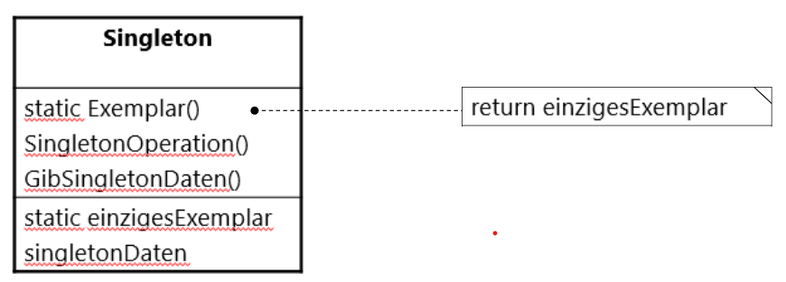

# Singleton Design Pattern in C#

---

## Einführung in das Singleton-Pattern

- **Definition**: Das Singleton-Pattern stellt sicher, dass nur eine Instanz einer Klasse existiert und bietet einen globalen Zugriffspunkt auf diese Instanz.
- **Anwendungsfälle**:
  - Wenn nur ein Objekt notwendig ist (z.B. Logging, Datenbankverbindung).
  - Wenn der Zustand über verschiedene Teile einer Anwendung hinweg geteilt werden muss.

---

## Vorteile des Singleton-Patterns

- **Konsistente Instanz**: Es gibt immer nur ein Objekt, was Inkonsistenzen vermeidet.
- **Globale Verfügbarkeit**: Einfache Zugänglichkeit durch die Anwendung hinweg.
- **Einfache Erweiterung**: Kann erweitert werden, um zusätzliche Funktionen oder Einstellungen zu bieten.

---

## Aufbau eines Singleton in C#

- Das Singleton-Pattern wird in C# mithilfe von **einer privaten statischen Instanz** und einer **öffentlichen statischen Zugriffsmethode** implementiert.
- Verwendung des **Lazy Initialization**-Prinzips zur Verbesserung der Effizienz.



---

## Implementierung in C#

```csharp
public sealed class Singleton
{
    // Private statische Instanz der Klasse
    private static Singleton? _instance = null;

    // Objekt für den Thread-sicheren Zugriff
    private static readonly object _lock = new object();

    // Privater Konstruktor, um Instanziierung von außen zu verhindern
    private Singleton() {}

    // Öffentliche Methode zum Zugriff auf die Singleton-Instanz
    public static Singleton Instance
    {
        get
        {
            lock (_lock)  // Thread-sichere Implementierung
            {
                if (_instance == null)
                {
                    _instance = new Singleton();
                }
                return _instance;
            }
        }
    }

    // Beispiel-Methode
    public void DoSomething()
    {
        Console.WriteLine("Singleton instance is doing something.");
    }
}
```

---

## Wichtige Punkte der Implementierung

- **Sealed Class**: Verhindert, dass andere Klassen vom Singleton erben und eine zweite Instanz erstellen.
- **Private Konstruktor**: Der Konstruktor ist privat, um externe Instanziierungen zu verhindern.
- **Thread-Sicherheit**: Der `lock`-Mechanismus stellt sicher, dass das Singleton-Objekt nur einmalig in einem Multi-Threading-Umfeld erstellt wird.

---

## Vor- und Nachteile des Singleton-Patterns

### Vorteile
- Einfache und zentrale Verwaltung einer einzigen Instanz.
- Reduzierter Speicherverbrauch, da nur ein Objekt existiert.

### Nachteile
- Kann zu **hoher Abhängigkeit** von der Singleton-Klasse führen.
- **Erweiterung und Testen** können kompliziert werden, da die Instanz global ist und nicht so leicht substituiert werden kann.

## Einsatz des Singleton in der Praxis

- **Datenbankverbindungen**: Eine einzige Instanz für die Verbindung zu einer Datenbank.
- **Logging**: Ein einzelner Logger kann für die gesamte Anwendung verwendet werden.
- **Konfigurationsmanager**: Gemeinsame Einstellungen werden zentral verwaltet.

---

## Zusammenfassung

- Das Singleton-Pattern ist nützlich, wenn nur eine Instanz einer Klasse existieren soll.
- Es sorgt für konsistente Daten, globale Verfügbarkeit und eine kontrollierte Instanziierung.
- Eine saubere Implementierung mit Thread-Sicherheit ist entscheidend, um mögliche Probleme zu vermeiden.
